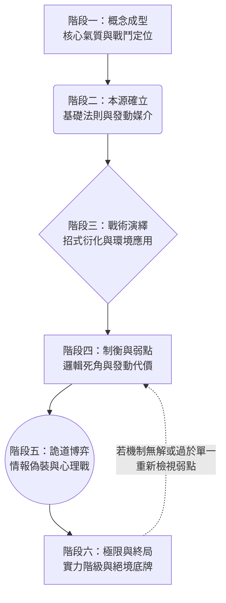

{/* 此檔案由同步腳本自動產生，請勿在此直接修改 */}

# 人物命軌與神通設定綱要

為了確保每一位登場角色的鬥法能力都能完美契合「東方玄幻大世」的天地綱常，並具備足夠的鬥智張力與陰陽制衡，特制定此標準設定推演。未來所有重要角色的能力設計，皆須按此六方推演進行。

## 📍 角色技能設計流程圖

---

## 📝 各階段詳細設定指南

### 階段一：意象初成
**目標：確立角色在鬥法中的「初始風魄」與「命軌至理」。**
1. **戰鬥氣質**：該角色戰鬥時給人的直觀感受是什麼？（例如：狂暴碾壓、優雅致命、猥瑣暗算、絕對防禦）。
2. **視覺母題**：與該角色綁定的核心視覺元素。（例如：主角的「碎鏡」、折鳶的「紙屑」、薛紅衣的「紅線」）。
3. **神獸溯源（若適用）**：若角色有神獸血脈，需確認其神獸的「核心本能」（如饕餮的吞噬、睚眥的復仇），這將深刻影響後續機制的發展。

### 階段二：本源確立
**目標：定義神通的「絕對法則」與「命軸憑依」。**
1. **【本初命機】定義**：用一句話概括其超凡之能的「天地造化法則」。（例如：改變接觸物的溫度、操縱特定材質的形狀、轉移痛覺）。**注意：越基礎的法則，越有鬥智的衍化空間。**
2. **【憑依鎮物】設定**：發動此能力必須依賴的「防具、武器或身體部位」。若此物被毀或被封印，機制將無法啟動。

### 階段三：戰術演繹
**目標：由基礎法則推導出實戰中的千變萬化。**
1. **【衍化萬相】（常用變招）**：基於「本初命機」，該角色最常用的攻擊、防禦與移動方式是什麼？
2. **環境互動律**：這套機制在哪種地形或天氣下會獲得極大增幅？又在哪種環境下會被嚴重削弱？

### 階段四：制衡與天驕弱點
**目標：為法則套上枷鎖，創造能被對手（或主角）利用的突破口。**
1. **【罩門】（因果死角）**：該功法在發動條件、作用對象或周天運轉上，存在什麼絕對的「盲點」？（例如：只能對活物生效、發動時腳不得離地等）。
2. **【天刑業報 / 逆心之鎖】（代價）**：常規發動的消耗是什麼？若超負荷使用，或違背本性使用，會付出什麼慘烈代價？（如壽命消耗、理智喪失）。

### 階段五：詭道博弈
**目標：在鬥法心術中建立「虛假表象」，增加生死搏殺的凶險程度。**
1. **【障眼虛訣】與【偽裝條件】**：該角色會故意做出什麼無意義的動作（結印、詠唱），或捏造什麼假情報來掩飾真正的「本初命機」？
2. **【餌敵之綻】**：角色會刻意賣出什麼「假弱點」來引誘對手攻擊，藉此完成反殺陷阱？

### 階段六：極限與終局
**目標：確立該角色在天地間的天花板與最後波紋。**
1. **所屬階級判定**：評估其機制的影響範圍，歸類其當前實力境界（執寸、羅身、布陣、覆天、無間）。
2. **【法息殘痕】**：施法時或周遭環境會出現什麼樣的靈力跡象？（供高階敵人判讀）。
3. **【飲恨化厲 / 絕境兵解】**：面臨必死之局時，燃燒所有生命與靈力所發動的「最終同歸於盡技能」或「死後詛咒」是什麼樣子？

---
*註：完成此六階段問卷後，該角色的戰鬥機制即算完全確立，可直接投入劇本實戰演練中。*
